## base

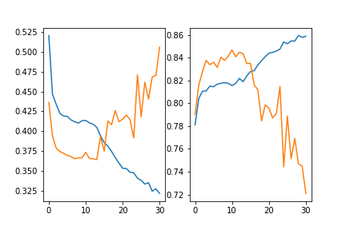

```python
epochs:31
batch_size:256
lr:0.001
embed_size:16
dense_hidden_size:32
word_gru_size:16
word_gru_layers:2
word_att_size:16
sentence_gru_size:16
sentence_gru_layers:2
sentence_att_size:16
word_per_sentence:40
sentence_per_document:120
dropout:0.5
```

## 2 增加全连接层 -->64

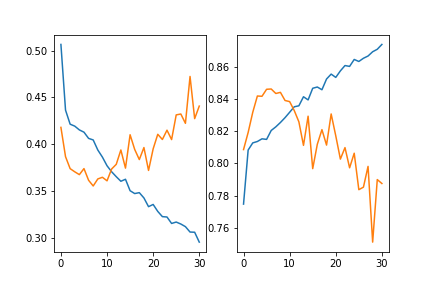

## 3 减小全连接层 -->16

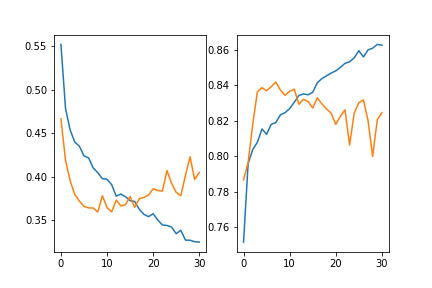

## 4  增大gru_size -->32

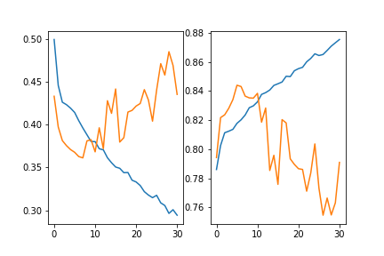

## 5 减小gru_size -->8

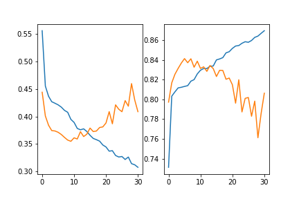

## 6 增大gru层 --> 4

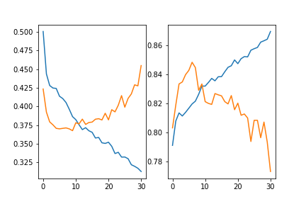

## 7 增大gru层 --> 6

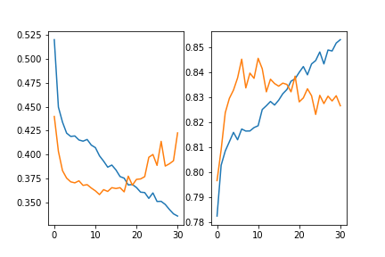

## 8 减小gru层 --> 1

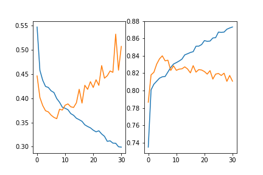

## 9 增大dropout

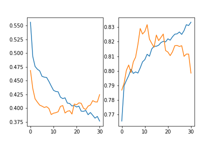

## 10 网络参数减半

```python
epochs:31
batch_size:256
lr:0.001
embed_size:8
dense_hidden_size:16
word_gru_size:8
word_gru_layers:2
word_att_size:8
sentence_gru_size:8
sentence_gru_layers:2
sentence_att_size:8
word_per_sentence:40
sentence_per_document:120
dropout:0.5
```

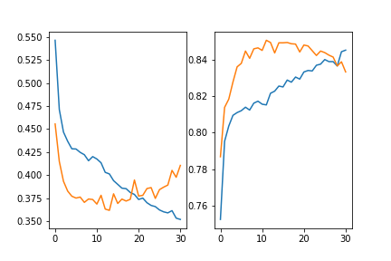

最高0.850


## 11 使用bn层

```
batch_size = 128
lr = 1e-3
embed_size = 16
dense_hidden_size = 32

word_gru_size = 16
word_gru_layers = 2
word_att_size = 32

sentence_gru_size = 16
sentence_gru_layers = 2
sentence_att_size = 32

word_per_sentence = 40
sentence_per_document = 120

dropout = 0.5
```

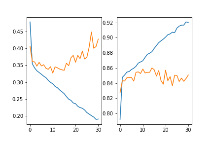


## 12 使用bn层

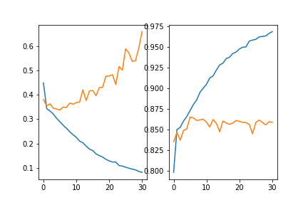


## 13 使用bn层 --> sentence -->4

```python
epochs:31
batch_size:256
lr:0.004
embed_size:16
dense_hidden_size:1
word_gru_size:8
word_gru_layers:2
word_att_size:8
sentence_gru_size:4
sentence_gru_layers:2
sentence_att_size:4
word_per_sentence:40
sentence_per_document:120
dropout:0.5
```

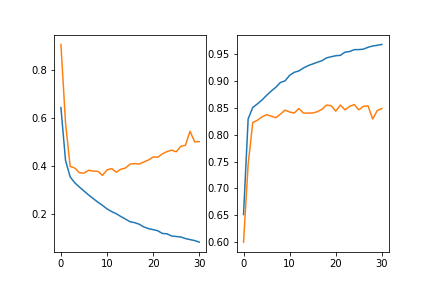


## best

0.849——>0.8644

随机种子 12 

drop 少

```python
epochs = 31
batch_size = 256
lr = 1e-3
embed_size = 16
dense_hidden_size = 32

word_gru_size = 16
word_gru_layers = 2
word_att_size = 16

sentence_gru_size = 16
sentence_gru_layers = 2
sentence_att_size = 16

word_per_sentence = 40
sentence_per_document = 120
```


drop 多 0.856 ——> 0.867
